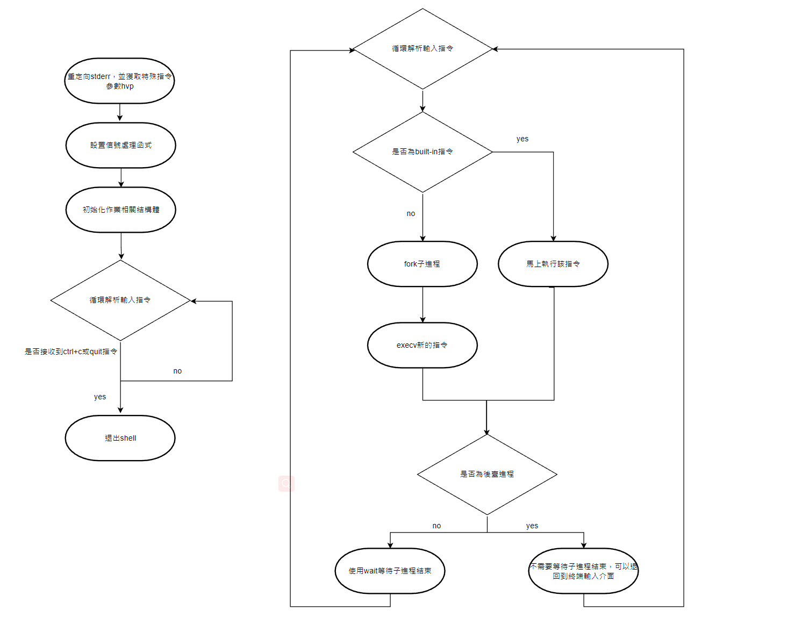
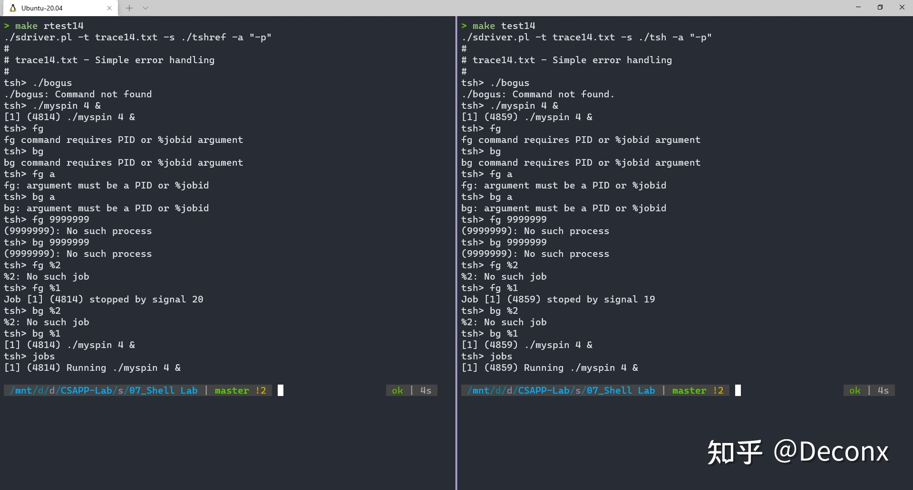

# Shell Lab實驗紀錄

## 簡介

本實驗要求我們編寫一個供使用者交互的終端介面，類似於Linux中的shell終端。實驗中我們需要先解析輸入指令(這些指令可能包含多個參數)，且指令必須支持進程背景執行。

另一個重點是該實驗模擬Unix系統中的作業控制(Job Control)，對創建的進程進行監控與管理(增、刪、改、查)。同時為了避免交互過程產生殭屍進程(Zombie)，我們需要編寫特殊的信號處理函式，並且該終端也要可以被Ctrl + C，Ctrl + Z退出程序和暫停程序。

細節部分可以參考資料夾中的`tshlab.pdf`中的`The tsh Specification`；程式編寫環節方面可以參考資料夾中的`shlab.pdf`整份文件

### 實驗要求
- 補全tsh.c中剩餘的代碼：
- void eval(char *cmdline)：解析並執行命令。
- int builtin_cmd(char **argv)：檢測命令是否為內置命令quit、fg、bg、jobs。
- void do_bgfg(char **argv)：實現bg、fg命令。
- void waitfg(pid_t pid)：等待前台命令執行完成。
- void sigchld_handler(int sig)：處理SIGCHLD信號，即子進程停止或終止。
- void sigint_handler(int sig)：處理SIGINT信號，即來自鍵盤的中斷ctrl-c。
- void sigtstp_handler(int sig)：處理SIGTSTP信號，即終端停止信號ctrl-z。
 
  使用make testn用來測試你編寫的shell執行第n組測試數據的輸出。- 

  使用make rtestn用來測試參考shell程序第n組測試數據的輸出（共16組測試數據）。- 

  tshref.out包含參考shell程序的所有測試數據的輸出結果，先看完該文件了解命令格式在開始編碼。

### 可用輔助函數：
- int parseline(const char *cmdline,char **argv)：獲取參數列表char **argv，返回是否為後台運行命令（true）。
- void clearjob(struct job_t *job)：清除job結構。
- void initjobs(struct job_t *jobs)：初始化jobs list。
- void maxjid(struct job_t *jobs)：返回jobs list中最大的jid號。
- int addjob(struct job_t *jobs,pid_t pid,int state,char *cmdline)：在jobs list中添加job
- int deletejob(struct job_t *jobs,pid_t pid)：在jobs list中刪除pid的job。
- pid_t fgpid(struct job_t *jobs)：返回當前前台運行job的pid號。
- struct job_t *getjobpid(struct job_t *jobs,pid_t pid)：返回pid號的job。
- struct job_t *getjobjid(struct job_t *jobs,int jid)：返回jid號的job。
- int pid2jid(pid_t pid)：將pid號轉化為jid。
- void listjobs(struct job_t *jobs)：打印jobs。
- void sigquit_handler(int sig)：處理SIGQUIT信號。

### 注意事項
- tsh的提示符為tsh>
- 用戶的輸入分為第一個的name和後面的參數，之間以一個或多個空格隔開。如果name是一個tsh內置的命令，那麼tsh應該馬上處理這個命令然後等待下一個輸入。否則，tsh應該假設name是一個路徑上的可執行文件，並在一個子進程中運行這個文件（這也稱為一個工作、job）
- tsh不需要支持管道和重定向
- 如果用戶輸入ctrl-c( ctrl-z)，那麼SIGINT( SIGTSTP)信號應該被送給每一個在前台進程組中的進程，如果沒有進程，那麼這兩個信號應該不起作用。
- 如果一個命令以“&”結尾，那麼tsh應該將它們放在後台運行，否則就放在前台運行（並等待它的結束）
- 每一個工作（job）都有一個正整數PID或者job ID（JID）。JID通過"%"前綴標識符表示，例如，“%5”表示JID為5的工作，而“5”代筆PID為5的進程。

- tsh應該有如下內置命令：

    quit: 退出當前shell

    jobs: 列出所有后台运行的工作

    bg <job>: 這個命令将会向<job>代表的工作发送SIGCONT信号并放在后台运行，<job>可以是一个PID也可以是一个JID。

    fg <job>: 這個命令会向<job>代表的工作发送SIGCONT信号并放在前台运行，<job>可以是一个PID也可以是一个JID。

- tsh應該回收（reap）所有殭屍孩子，如果一個工作是因為收到了一個它沒有捕獲的（沒有按照信號處理函數）而終止的，那麼tsh應該輸出這個工作的PID和這個信號的相關描述。

### 提示
- 仔細閱讀CSAPP第八章的異常控制流和lab的writeup- 

- make testn測試shell執行第n組測試數據的輸出，make rtestn打印shell預期輸出，tshref.out包含shell所有預期輸出結果，先看文件輸出，了解命令格式再編碼，修改makefile文件中CFLAGS字段，加-g參數並- 去掉-O2參數- 

- waitpid, kill, fork, execve, setpgid,sigprocmask很常用，可通過命令手冊查看使用細節，WUNTRACED和WNOHANG選項對waitpid也很有用- 

- 實現信息處理函數，確保發送SIGINT和SIGTSTP信號給整個前台進程組，用-pid代替pid作為kill參數- 

- 建議在waitfg的循環中用sleep函數，在sigchld_handler中對waitpid只調用一次- 

- eval中進程在fork之前用sigprocmask阻塞SIGCHLD信號，之後在解除信號阻塞，之後在調用addjob添加孩子到作業列表用sigprocmask阻塞信號，因為子繼承繼承父進程的阻塞集合，所以子程序必須確保在執行新進- 程前解除阻塞SIGCHLD信號。父進程需以這種方式阻塞SIGCHLD信號，避免在父進程調用addjob之前，SIGCHLD處理器獲取子進程(從而從任務列表中刪除)的競爭狀態。- 

- 不要直接調用常用命令，而應輸入完整路徑，如/bin/ls- 

- 當在標準Unix shell運行tsh時，tsh運行在前台進程組中。若tsh隨後創建子進程，默認情況下，該子進程也是前台進程組的成員。因為按下ctrl-c會向前台組中的每個進程發送SIGINT信號，按下ctrl-c會向tsh及- Unix shell創建的每個子進程，顯然不正確。應該在fork後，但在execve前，子進程調用setpgid(0,0)，把子進程放到新進程組中，該進程組ID與子進程的PID相同。確保前台進程組中只有一個進程，即tsh進程。當- 按下ctrl-c時，tsh應捕獲生成的SIGINT，然後將其轉發給包含前台作業的進程組。

## 主結構

### 主程式架構



### eval

編寫`eval`的重點在創建子進程部分，也就是`fork`後使用`execve`加載指令bin檔這部分。由於`fork`指令的特性，我們無法保證父進程部分程式碼會先執行，有可能在添加作業前，`SIGCHLD`就已經抵達，所以在`fork`前要先對`SIGCHLD`進行屏蔽

```c
void eval(char *cmdline) {

    /* error handler */
    if(cmdline == NULL){

        return;
    }

    char *argv[MAXARGS] = {0};
    char buffer[MAXLINE] = {0};
    int bg;
    pid_t pid;
    sigset_t mask_all, mask_one, prev_one;

    /* 創建遮罩用來阻擋信號SIGCHLD */
    sigfillset(&mask_all);
    sigemptyset(&mask_one);
    sigaddset(&mask_one, SIGCHLD);

    strcpy(buffer, cmdline);
    
    /* 判斷該指令是否為後臺進程 */
    bg = parseline(buffer, argv);

    /* if command is a empty command, then return */
    if(argv[0] == NULL){

        return;
    }

    /* 是否為built-in command */
    if(!builtin_cmd(argv)){

        /* 為了避免race condition，確保邏輯是先添加進程再觸發SIGCHLD */
        Sigprocmask(SIG_BLOCK, &mask_one, &prev_one);

        /* fork a child process */
        if((pid = Fork()) == 0){

            /* 子進程會繼承父進程的信號向量表，所以需要unblock SIGCHLD，避免加載的進程無法觸發SIGCHLD */
            Sigprocmask(SIG_SETMASK, &prev_one, NULL); // unblock SIGCHLD

            setpgid(0, getpid()); // set process group id 

            if(execve(argv[0], argv, environ) < 0){

                printf("%s: Command not found.\n", argv[0]);
                exit(0);
            }
        }

        /* 該遮罩確保添加作業過程不會被其他信號中斷 */
        Sigprocmask(SIG_BLOCK, &mask_all, NULL); // block all signals
        addjob(jobs, pid, (bg ? BG : FG), buffer); // add job
        /* 回復成原先狀態，允許接收SIGCHLD信號 */
        Sigprocmask(SIG_SETMASK, &prev_one, NULL); // unblock all signals

        /* 前臺進程需要等待子進程結束 */
        if(!bg){

            waitfg(pid);
        }
        /* 若為後臺進程則打印進程相關信息後退出 */
        else{

            #if (DEBUG_LOG)
            
            int i=1;
            strcpy(debug_log, argv[0]);

            while(argv[i]){

                strcat(debug_log, " ");
                strcat(debug_log, argv[i++]);
            }

            printf("[%d] (%d) %s &\n", getjobpid(jobs, pid)->jid, pid, debug_log);
            #endif
        }
    }

    return;
}
```

### builtin_cmd

`builtin_cmd`較為簡單，只需要依照相應的指令執行就可以了，重點在於`bg`, `fg`這兩個指令。若為built-in command則反為1，否則返回0

```c
int builtin_cmd(char **argv) {

    int ret = 1;

    /* 退出程序 */
    if(!strcmp(argv[0], "quit")){

        exit(0);
    }
    /* 列出後臺進程信息 */
    else if(!strcmp(argv[0], "jobs")){

        listjobs(jobs);
        // listbgjobs(jobs); // list only back ground job
    }
    /* restarts job by sending it a SIGCONT signal, and then runs it in the
       background. The job argument can be either a PID or a JID. */
    else if(!strcmp(argv[0], "bg")){

        do_bgfg(argv);
    }
    /* restarts job by sending it a SIGCONT signal, and then runs it in the
       foreground. The job argument can be either a PID or a JID. */
    else if(!strcmp(argv[0], "fg")){

        do_bgfg(argv);
    }
     /* not a builtin command (include invalid syntax) */
    else{

        ret = 0;
    }

    return ret;    
}

```

### do_bgfg

該函式是針對中止狀態的背景進程的操作。首先需要發送信號`SIGCONT`將進程狀態更改成運行中，若運行後的進程是前臺進程就等待，反之就退出就好了(記得要調用作業控制函式去修改全局作業變數的狀態!)

`fg`, `bg`後面可以接上PID, 或`JID`(作業編號)，例如`fg 1000`，若是使用作業編號要加上特殊符號%，例如`fg %1`

```c
void do_bgfg(char **argv) {

    /* error handler */
    if(argv == NULL){

        return;
    }

    /* 判斷是執行fg還是bg */
    u_int8_t fgbg = 1; // define 0 for front ground; 1 for back ground
    fgbg = strcmp(argv[0], "bg") == 0;

    if(argv[1] == NULL){
            
        printf("%s command requires PID or %%jobid argument\n", argv[0]);
        return;
    }

    int target_jid;
    pid_t target_pid;
    struct job_t* job_ptr;

    /* 參數是針對jid */
    if(argv[1][0] == '%'){

        target_jid = atoi(argv[1]+1);

        if(!target_jid){
            
            printf("%s: argument must be a PID or %%jobid\n", argv[0]);
            return;
        }

        if((job_ptr = getjobJid(jobs, target_jid)) == NULL){

            printf("%%%d: No such job\n", target_jid);
            return;
        }
    }
    /* 參數是針對pid */
    else{

        target_pid = atoi(argv[1]);

        if(!target_pid){
            
            printf("%s: argument must be a PID or %%jobid\n", argv[0]);
            return;
        }

        if((job_ptr = getjobpid(jobs, target_pid)) == NULL){

            printf("(%d): : No such process\n", target_pid);
            return;
        }
    }

    /* 發送信號給指定進程 */
    Kill(-(job_ptr->pid), SIGCONT); // Continue if stopped

    switch (fgbg){

        /* 若為前臺進程，則需要等待進程結束 */
        case FRONT_GROUND:
            job_ptr->state = FG;
            waitfg(job_ptr->pid);
        break;

        /* 後臺進程打印信息後退出即可 */
        case BACK_GROUND:
            job_ptr->state = BG;

            #if (DEBUG_LOG)
                printf("[%d] (%d) %s", job_ptr->jid, job_ptr->pid, job_ptr->cmdline);
            #endif
        break;

        case UNKNOWED:
            #if (DEBUG_LOG)
                printf("fatal errror! fgbg is neither 0 nor 1\n");
            #endif
            exit(1);
        break;
    }
}
```

### waitfg

用來等待前臺進程結束，循環等待子進程結束，然後觸發`SIGCHLD`信號處理函式後回收子進程

```c
void waitfg(pid_t pid){

    if(pid <= 0){
        
        return;
    }

    struct job_t* fg = getjobpid(jobs, pid);

    if(fg == NULL){

        return;
    }

    sigset_t mask;

    /* 阻擋除了SIGCHLD以外的所有信號 */
    sigfillset(&mask);
    sigdelset(&mask, SIGCHLD);
    sigdelset(&mask, SIGINT);
    sigdelset(&mask, SIGTSTP);

    /* 等待SIGCHLD信號 */
    for(; fgpid(fg) != 0; ){

        Sigsuspend(&mask); // suspend until SIGCHLD arrives
    }
}
```

### sigchld_handler

回收前後臺進程並打印子進程結束資訊，注意該函式不會阻塞等待子進程。為了確保執行信號處理函式過程中不被其他信號打斷，可以先行阻擋其他信號

```c
void sigchld_handler(int sig) {

    sigset_t mask, prev;

    int stat, olderr = errno; // save original errno
    pid_t pid;

    sigfillset(&mask);

    /* 阻擋其他信號 */
    Sigprocmask(SIG_BLOCK, &mask, &prev);

    while((pid = waitpid(-1, &stat, WNOHANG | WUNTRACED)) > 0){

        /* 進程正常退出 */
        if(WIFEXITED(stat)){

            #if (DEBUG_LOG)
            // sprintf(debug_log, "child process [pid: %d] is terminated normally\n", pid);
            // Sio_print(debug_log);
            #endif

            /* 刪除作業 */
            deletejob(jobs, pid);
        }
        /* 子進程被信號中止 */
        else if(WIFSIGNALED(stat)){

            #if (DEBUG_LOG)
            sprintf(debug_log, "Job [%d] (%d) terminated by signal %d\n", getjobpid(jobs, pid)->jid, pid, WTERMSIG(stat));
            Sio_print(debug_log);
            #endif

            /* 刪除作業 */
            deletejob(jobs, pid);
        }
        /* 子進程被信號中止 */
        else if(WIFSTOPPED(stat)){

            #if (DEBUG_LOG)
            sprintf(debug_log, "Job [%d] (%d) stopped by signal %d\n", 
                       getjobpid(jobs, pid)->jid, pid, WSTOPSIG(stat));
            Sio_print(debug_log);
            #endif

            struct job_t* target = getjobpid(jobs, pid);
            target->state = ST;
        }
        /* 中止的子進程收到信號SIGCONT */
        else if(WIFCONTINUED(stat)){

            #if (DEBUG_LOG)
            sprintf(debug_log, "child JID: %d, PID: %d is resumed by signal SIGCONT\n", 
                       pid2jid(pid), pid);
            Sio_print(debug_log);
            #endif
        }
    }

    /* 解鎖 */
    Sigprocmask(SIG_SETMASK, &prev, NULL);

    errno = olderr; // restore erron
    
    return;
}
```

### sigint_handler

ctrl + c的信號處理函式，直接發送一個`SIGINT`信號給前臺進程組為`pid`的所有進程

```c
void sigint_handler(int sig) {

    pid_t pid = fgpid(jobs);

    if(pid == 0){

        Sio_print("No front ground job!\n");
        return ;
    }

    Kill(-pid, SIGINT); // close front ground process group 

    return;
}
```

### sigstp_handler

ctrl + z的信號處理函式，直接發送一個`SIGTSTP`信號給前臺進程組為`pid`的所有進程

```c
void sigtstp_handler(int sig) {

    pid_t pid = fgpid(jobs);

    if(pid == 0){

        Sio_print("No front ground job!\n");
        return ;
    }

    Kill(-pid, SIGTSTP); // stop front ground process group 

    return;
}
```
### 測試方式
實驗文件還包括了作者製作的參考tsh，以及16 個測試用例，通過跑用例查看結果與參考tsh 是否相同，就能判斷我們寫的tsh 有無問題，我這裡僅放出其中幾個用例的測試截圖（左邊為參考tsh，右邊為我的tsh）：


